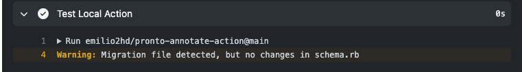
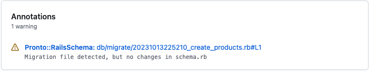
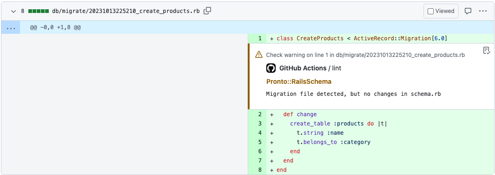

# pronto-annotate-action

[](https://github.com/super-linter/super-linter)


This action is meant to work with [pronto-annotations-formatter](https://github.com/emilio2hd/pronto-annotations-formatter).
No need to use GitHub oauth token.

Learn more about pronto at <https://github.com/prontolabs/pronto>.

## Usage

To include the action in a workflow in another repository, you can use the
`uses` syntax with the `@` symbol to reference a specific branch, tag, or commit
hash.

```yaml
steps:
  - name: Checkout
    id: checkout
    uses: actions/checkout@v3

  - name: Test Local Action
    id: test-action
    uses: emilio2hd/pronto-annotate-action@0.1.0
    with:
      reportPath: annotations.json
```

Note, you can also point to the `main` branch with `uses: emilio2hd/pronto-annotate-action@main`

Please, check this [annotations.json](__tests__/annotations.json),
to see the expected json content.

Once you run the step, you should see the annotations on the following places:






## Development Setup

After you've cloned the repository to your local machine or codespace, you'll
need to perform some initial setup steps before you can develop your action.

> [!NOTE]
>
> You'll need to have a reasonably modern version of
> [Node.js](https://nodejs.org) handy. If you are using a version manager like
> [`nodenv`](https://github.com/nodenv/nodenv) or
> [`nvm`](https://github.com/nvm-sh/nvm), you can run `nodenv install` in the
> root of your repository to install the version specified in
> [`package.json`](./package.json). Otherwise, 20.x or later should work!

1. :hammer_and_wrench: Install the dependencies

   ```bash
   npm install
   ```

1. :building_construction: Package the TypeScript for distribution

   ```bash
   npm run bundle
   ```

1. :white_check_mark: Run the tests

   ```bash
   $ npm test

   PASS  ./index.test.js
     ✓ throws invalid number (3ms)
     ✓ wait 500 ms (504ms)
     ✓ test runs (95ms)

   ...
   ```

## Update the Action Code

There are a few things to keep in mind when writing your action code:

- Most GitHub Actions toolkit and CI/CD operations are processed asynchronously.
  In `main.ts`, you will see that the action is run in an `async` function.

  ```javascript
  import * as core from '@actions/core'
  //...

  async function run() {
    try {
      //...
    } catch (error) {
      core.setFailed(error.message)
    }
  }
  ```

  For more information about the GitHub Actions toolkit, see the
  [documentation](https://github.com/actions/toolkit/blob/master/README.md).
